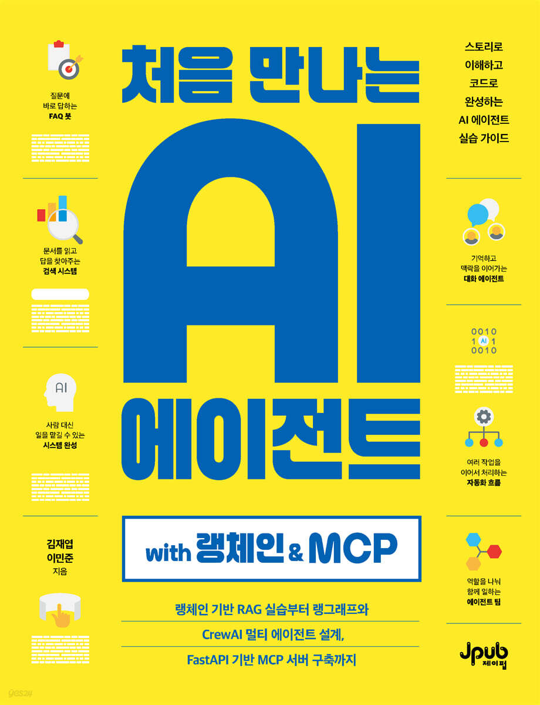

# 처음 만나는 AI 에이전트 with 랭체인 & MCP

<p align="center">
  <a href="https://www.yes24.com/product/goods/187043724">
    
  </a>
</p>

<p align="center">
  <strong>스토리로 이해하고 코드로 완성하는 AI 에이전트 실습 가이드</strong><br>
  랭체인 기반 RAG 실습부터 랭그래프와 CrewAI 멀티 에이전트 설계, FastAPI 기반 MCP 서버 구축까지 다룹니다.
</p>

<p align="center">
  <a href="https://www.yes24.com/product/goods/187043724"><strong>YES24에서 책 보기</strong></a>
  ·
  <a href="#챕터별-구성"><strong>예제 코드 둘러보기</strong></a>
  ·
  <a href="./ERRATA.md"><strong>정오표 확인</strong></a>
</p>

---

이 리포지토리는 《처음 만나는 AI 에이전트 with 랭체인 & MCP》의 예제 코드와 보조 자료를 담고 있습니다. 책을 따라 실습하거나, 필요한 챕터만 골라 AI 에이전트의 핵심 구성요소를 빠르게 확인할 수 있습니다.

## 챕터별 구성

### [Chapter 2: LLM 기본 원리와 API 활용](./chapter2)
AI 에이전트의 핵심인 LLM(Large Language Model) 이해
- LLM 작동 원리와 시뮬레이터
- 통합 LLM 인터페이스 (Ollama/OpenAI 자동 감지)
- 토큰화와 프롬프트 엔지니어링
- Mock 모드를 통한 테스트

### [Chapter 3: AI 에이전트 핵심 구성요소](./chapter3)
에이전트의 필수 구성요소와 프레임워크 활용
- 메모리 시스템 (단기/장기/작업 기억)
- 도구(Tool) 관리 및 실행
- 계획(Planning) 수립과 실행(Execution)
- LangChain, LangGraph, CrewAI 프레임워크 맛보기

### [Chapter 4: 실전 AI 에이전트 구축](./chapter4)
단계별로 배우는 실전 에이전트 개발
- LangChain 브리지 패턴
- 실제 LLM 통합 및 캐싱
- 도구 시스템과 하이브리드 검색
- ReAct 패턴과 메모리 통합
- 프로덕션 메트릭 및 모니터링

### [Chapter 5: 협업형 멀티 에이전트](./chapter5)
멀티 에이전트 협업 패턴과 주요 프레임워크 활용
- 기본 협업 시스템
- 조건부 협업
- LangGraph 프레임워크
- CrewAI 프레임워크
- 하이브리드 시스템

### [Chapter 6: MCP 통합](./chapter6)
Model Context Protocol을 활용한 에이전트 통합
- MCP 어댑터 구현
- LangChain/LangGraph/CrewAI 통합
- 통합 워크플로우

### [Chapter 7: MCP 서버/클라이언트](./chapter7)
MCP 기반 에이전트 서버와 클라이언트 구현
- MCP 서버 엔드포인트
- MCP 클라이언트
- 비즈니스 도메인 도구 (고객, 주문, 리포트)

---

## 부록(Appendix) — 책에는 수록되지 않았지만 함께 공부하면 좋은 확장 주제

책의 본문에서는 분량 관계로 아래 두 개 주제를 다루지 않았습니다. 실제 프로덕션/엣지 환경으로 한 걸음 더 나아가고 싶은 독자를 위해 예제 코드를 별도 폴더로 보존해 두었습니다. 본문의 흐름(Chapter 2 → 7)을 모두 마친 뒤 자율 학습용으로 참고해 주세요.

### [Appendix A: 프로덕션 배포](./appendix_a_production)
Docker 기반 에이전트 배포와 운영
- Docker 컨테이너화
- 로깅 및 모니터링
- 배포/롤백 자동화
- Slack 알림 통합

### [Appendix B: 고급 최적화](./appendix_b_optimization)
에이전트 성능 최적화 및 엣지 배포
- 엣지 환경 배포 (Ollama, GGUF)
- 오프라인 RAG 시스템
- 다국어 지원
- 다단계 캐싱 및 체인 최적화

---

## 시작하기

### 1) 리포지토리 클론 & 가상환경 준비
```bash
git clone <repository-url>
cd ai-agents-book

# (권장) 가상환경 생성
python -m venv .venv
source .venv/bin/activate     # macOS / Linux
# .venv\Scripts\activate      # Windows PowerShell
```

### 2) 의존성 설치
```bash
# 책 본문(Chapter 2~7)에 필요한 모든 패키지를 한 번에 설치
pip install -r requirements.txt
```

> 부록 A·B의 일부 예제는 추가 패키지(`slack-sdk`, `psutil`, `langdetect`, `ollama` 등)가 필요합니다. 해당 폴더의 README를 참고해 주세요.

### 3) LLM 설정(선택)
```bash
# A. Ollama (로컬 LLM - 권장)
#   설치: https://ollama.com
ollama pull llama3.2

# B. 또는 OpenAI API 키 사용
export OPENAI_API_KEY='sk-...'     # macOS / Linux
# set OPENAI_API_KEY=sk-...        # Windows CMD
```

**Ollama나 OpenAI가 없어도 Mock 모드로 모든 예제를 실행**할 수 있습니다. `chapter2/llm_interface.py`의 `LLM()` 객체가 자동으로 환경을 감지해 Ollama → OpenAI → Mock 순으로 전환합니다.

### 4) 빠른 실행 예시
```bash
# Chapter 2: LLM 기본 원리
python chapter2/llm_interface.py

# Chapter 3: 통합 에이전트
python chapter3/agent/example.py

# Chapter 4: 단계별 구축
python chapter4/step1_basic/simple_llm_bridge.py

# Chapter 5: 멀티 에이전트
python chapter5/basic_collaboration.py
```

> 모든 예제는 리포지토리 루트에서 `python <path>` 형태로 실행할 수 있도록 경로를 맞춰 두었습니다. 각 폴더로 `cd` 이동해서 실행하는 것도 가능합니다.

## 챕터별 README
각 챕터 폴더의 `README.md`에 **학습 포인트, 실행 방법, 추가 의존성**이 정리돼 있습니다. 처음 실행 시에는 반드시 챕터 README를 먼저 읽어 주세요.

## 문제 해결
- `ModuleNotFoundError: No module named 'xxx'` → `pip install -r requirements.txt`를 다시 실행하거나 가상환경이 활성화돼 있는지 확인하세요.
- Ollama 연결 오류 → `ollama serve` 또는 Ollama 앱이 실행 중인지 확인하세요. 연결되지 않으면 자동으로 Mock 모드로 폴백됩니다.
- `OPENAI_API_KEY`가 설정되어 있어도 OpenAI가 호출되지 않는다면 가상환경을 새로 활성화한 뒤 다시 시도하세요.

## 정오표(ERRATA) · 설치 가이드
- [`ERRATA.md`](./ERRATA.md) — 책 본문의 오탈자, 저장소 코드와의 차이(예: 7장 헬스체크 엔드포인트 `/mcp/health`, 5장 CrewAI 모델명), 개념 예제에 대한 보조 실행 스크립트 매핑이 정리되어 있습니다. 예제를 실행하기 전에 한 번씩 훑어봐 주세요.
- [`docs/requirements_guide.md`](./docs/requirements_guide.md) — 챕터별로 필요한 `pip install` 명령과 환경 변수, 실행 순서를 정리한 가이드입니다. 한 번에 전부 설치하고 싶을 때는 루트의 `requirements.txt`를 사용해도 됩니다.

## 보조 실행 스크립트(`run_*.py`)
책 본문은 개념 설명에 집중하기 위해 일부 예제 파일에 `if __name__ == "__main__":` 블록을 넣지 않았습니다. 저장소에서는 책과 동일한 예제 파일을 유지하면서, 같은 폴더에 `run_*.py` 보조 스크립트를 두어 바로 실행해 볼 수 있도록 구성했습니다.

| 책 코드 번호 | 예제 파일 | 실행 스크립트 |
| --- | --- | --- |
| 5-10 ~ 5-12 | `chapter5/crewai_agents.py` | `chapter5/run_crewai.py` |
| 6-1, 6-2 | `chapter6/examples/traditional_integration.py` | `chapter6/examples/run_traditional_integration.py` |
| 6-3, 6-4 | `chapter6/examples/mcp_unified_approach.py` | `chapter6/examples/run_mcp_unified.py` |
| 6-5 | `chapter6/core/communication_flow.py` | `chapter6/core/run_communication_flow.py` |
| 6-6 | `chapter6/protocol/jsonrpc_structure.py` | `chapter6/protocol/run_jsonrpc_structure.py` |
| 6-16 | `chapter6/adapters/langchain_mcp_adapter.py` | `chapter6/adapters/run_langchain_mcp.py` |
| 6-17 | `chapter6/adapters/langgraph_mcp_node.py` | `chapter6/adapters/run_langgraph_mcp.py` |
| 6-18 | `chapter6/adapters/crewai_mcp_integration.py` | `chapter6/adapters/run_crewai_mcp.py` |

실행 예:
```bash
python chapter6/protocol/run_jsonrpc_structure.py
python chapter6/core/run_communication_flow.py
```
